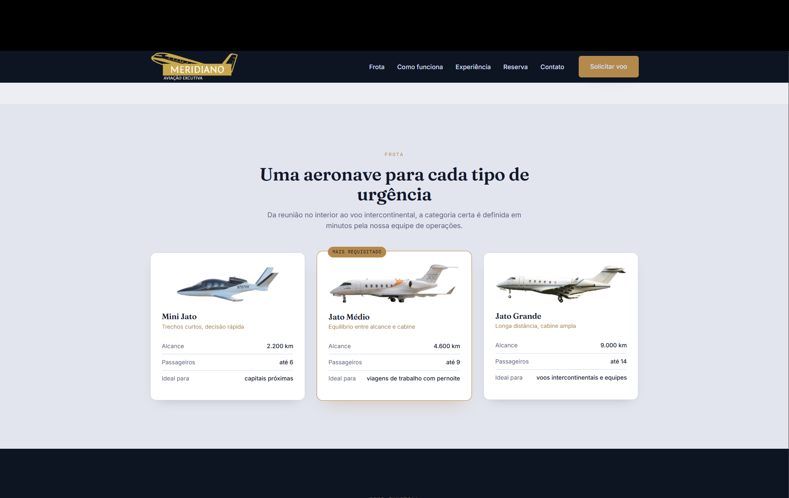
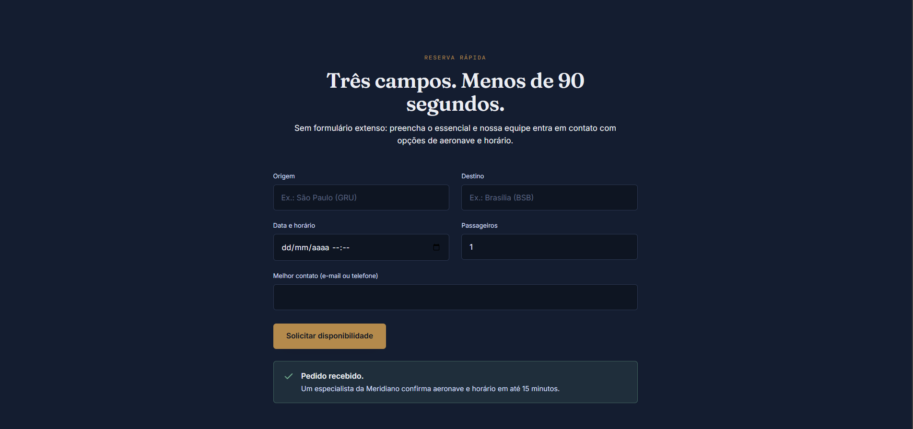

# Meridiano — Aviação Executiva

[Clique aqui para acessar o site da Meridiano — Aviação Executiva](https://miguel-boff-moura.github.io/meridiano-aviacao-executiva/)

Landing page responsiva desenvolvida para as disciplinas de **Criação de Sites** e **Design Gráfico**. O projeto apresenta uma empresa fictícia de fretamento de jatos executivos, priorizando uma interface moderna, elegante e focada na experiência do usuário.

O objetivo foi desenvolver uma interface limpa, responsiva e intuitiva, destacando os principais serviços da empresa, sua frota e um fluxo simplificado para solicitação de voos.

---

## Funcionalidades

- Layout totalmente responsivo
- Menu de navegação adaptável para dispositivos móveis
- Apresentação dos diferenciais da empresa
- Exibição da frota de aeronaves
- Seção explicando o funcionamento do serviço
- Depoimento de cliente
- Formulário **rápido** de solicitação de voo

---

## Tecnologias utilizadas

- HTML5
- CSS3
- Flexbox
- CSS Grid
- Media Queries

## Estrutura do projeto

```
Meridiano/
│
├── index.html
├── style/
│   └── style.css
│
├── img/
│   ├── menu.svg
│   ├── jato_pequeno.png
│   ├── jato_medio.png
│   ├── jato_grande.png
│   └── logo-meridiano.png
│
└── README.md
```

---

## Como executar

1. Clone o repositório:

```bash
git clone https://github.com/seu-usuario/meridiano.git
```

2. Entre na pasta do projeto:

```bash
cd meridiano
```

3. Abra o arquivo `index.html` em qualquer navegador.

---

## Preview






---

## Projeto acadêmico

Este projeto foi desenvolvido exclusivamente para fins educacionais como atividade das disciplinas de **Criação de Sites** e **Design Gráfico**.

Todo o conteúdo apresentado é fictício.

---

## Autor

Desenvolvido por **Miguel A. B. de Moura**.
